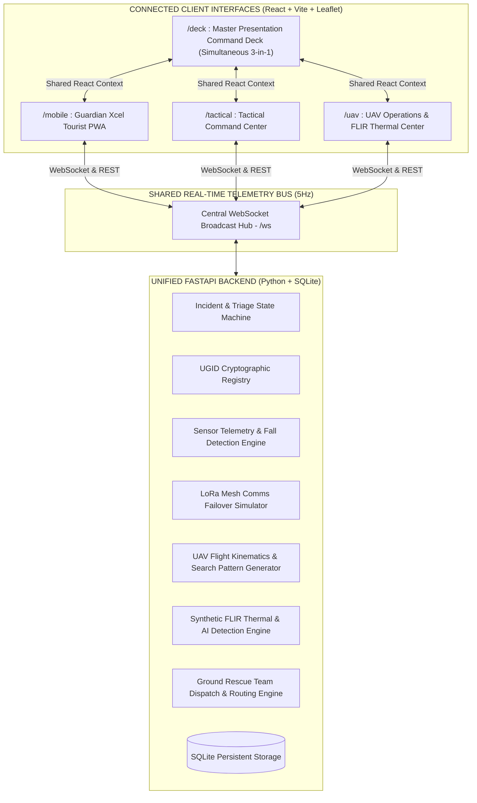

# GUARDIAN XCEL // AUTONOMOUS RESCUE SYSTEM
### Autonomous AI-Based Tourist Emergency Detection & Drone-Assisted Rescue Coordination Platform

**Guardian Xcel** is a zero-budget, competition-grade emergency detection, tactical command-and-control, autonomous drone search-and-rescue (SAR), and ground team coordination prototype.

---

## 1. System Architecture



---

## 2. The 4 Connected Interfaces

### 1. Guardian Xcel Mobile PWA (`/mobile`)
- **Visual Design:** Dark tactical HUD styling with cyan cyber accents (`#00f0ff`), CRT scanline overlay, and high-density telemetry.
- **Top Status Bar:** 5Hz WebSocket indicator, LoRa failover status (`4G LTE` vs `LoRa 868MHz`), and live battery percentage.
- **Identity & Auto-Location:** Verified UGID (`GX-8921-ALPHA`), active auto-location tracking, GPS coordinates ($37.7420^\circ\text{N}, 119.5975^\circ\text{W}$), altitude ($1240\text{m}$), and RTK accuracy ($\pm 2.4\text{m}$).
- **4 Dedicated Navigation Tabs:**
  - **`HOME`:** Threat Gauge (Safe, At Risk, Critical), live metrics grid (Speed, BPM, Battery, GPS, Step Count, G-Force), animated radar sweep HUD, 3-axis accelerometer waveform oscilloscope, and security status.
  - **`EXPLORE`:** Interactive Leaflet terrain map with safe geofencing perimeter (green dashed polygon), cliff hazard danger zones (red polygon), self-location beacon, and nearby registered hikers list.
  - **`SAFETY`:** Threat level card, geofence compliance, uplink channel status, AI Guard status matrix (Fall detect, Inactivity, Anomaly score), sector safety nodes, and cryptographic event history.
  - **`PROFILE`:** Verified UGID digital badge, hiker medical notes (blood type, allergies), emergency contact information, AES-256 encryption state, and sensor diagnostic checklist.
- **Emergency Panic Control:** Prominent **`BROADCAST MANUAL SOS`** button wired to backend emergency triage.
- **Demo Sensor Controls:** Interactive simulation buttons for judges (`NORMAL WALK`, `SIMULATE FALL (3.8G)`, `SIMULATE IMMOBILITY`, `LORA FAILOVER`).
- **Emergency Overlay:** Automatic full-screen emergency takeover with synchronized 6-stage rescue pipeline tracker (`EMERGENCY DETECTED` $\rightarrow$ `UAV DISPATCHED` $\rightarrow$ `SEARCH IN PROGRESS` $\rightarrow$ `VICTIM LOCATED` $\rightarrow$ `RESCUE TEAM EN ROUTE` $\rightarrow$ `RESCUE COMPLETED`).

### 2. Tactical Command Center (`/tactical`)
- **Top Bar:** Live system time, operational status, DEFCON level, network/uplink status (`ONLINE // WEBSOCKET: 5Hz`), and master demo triggers.
- **Left Panel (Tourist Monitoring):**
  - Summary metric counters: `TOTAL (4)`, `SAFE` (Green), `AT RISK` (Amber), `EMERGENCY` (Red).
  - Registered beacon list (`GX-8921-ALPHA`, `GX-4412-BRAVO`, `GX-1109-DELTA`, `GX-7723-SIERRA`) with live vitals.
  - Selected Tourist Inspector displaying profile, medical notes, emergency contact, exact coordinates, and live 3-axis accelerometer telemetry.
- **Center Panel (GIS Radar Map):**
  - Large satellite/terrain Leaflet map with Dark Matter tiles and rotating radar sweep overlay.
  - Renders all registered tourist markers with color-coded threat states.
  - Automatically pans and focuses on victim marker with glowing pulse beacon during emergency incidents.
  - Safe geofence boundary, cliff hazard danger zone, UAV position and flight vectors, and Ground Rescue Unit (`Echo-4`) route vector.
  - Last Known Position (LKP) target marker.
- **Right Panel (Active Incident):**
  - Active incident number, target UGID, threat level badge, incident trigger type, LKP coordinates, detection timestamp, communication mode, assigned UAV, and assigned rescue team.
  - Tactical command override buttons: `[SCRAMBLE UAV-ALPHA]`, `[DISPATCH GROUND RESCUE]`, and `[MARK INCIDENT RESOLVED]`.
- **Bottom Panel (Live Event Timeline):**
  - Formatted live event timeline with timestamped entries (`HH:MM:SS — Impact detected`, `HH:MM:SS — UAV dispatched`, etc.).
  - Real-time communication indicators: `ONLINE`, `WEBSOCKET`, `LORA FALLBACK`, `OFFLINE`.

### 3. UAV Operations & Search Center (`/uav`)
- **Header:** Drone mission control header with sector callout and satellite RTK GNSS lock.
- **Left Panel (Drone Squadron Fleet):**
  - Telemetry cards for `DRONE-01` (Primary Tactical SAR), `DRONE-02` (LoRa Mesh Relay), and `DRONE-03` (Long-Range Thermal Scout).
  - Live battery %, voltage, GPS coordinates, altitude (AGL), airspeed, signal strength (dBm), and current mission.
- **Center Panel (UAV Search Map):**
  - Dedicated search map with UAV position, heading orientation, target LKP, 120m search envelope radius, expanding square search pattern trajectory, and locked victim pin.
- **Right Panel (Mission Control & FLIR Thermal Search):**
  - Live distance-to-target countdown, search progress %, and rescue handoff indicator.
  - Mission Controls: `[DISPATCH UAV]`, `[START SEARCH]`, `[THERMAL SCAN]`, `[RETURN TO BASE]`.
  - **Simulated FLIR Thermal Search Feed:** HTML5 Canvas Ironbow infrared stream with terrain noise, search sweeps, candidate evaluations, and AI bounding box target lock (`HUMAN_BIO_SIGNATURE [36.8°C] 97.6% CONFIDENCE`).

### 4. Master Presentation Command Deck (`/deck`)
- Reuses the **exact same live functional components** from `/mobile`, `/tactical`, and `/uav` in a cohesive 3-in-1 cyber-command screen.
- Top master control bar with "RUN FULL RESCUE DEMO" and a 10-step sequential visual progress tracker.

---

## 3. 10-Step Automated Rescue Demonstration Lifecycle

Clicking **"RUN FULL RESCUE DEMO"** executes the end-to-end emergency pipeline:

```
[Phase 1] NORMAL TOURIST         -> Baseline telemetry streaming (1.0g gait, 76 BPM, 4G LTE)
[Phase 2] FALL IMPACT DETECTED   -> High-G impact spike (3.8g) detected by accelerometer
[Phase 3] INACTIVITY CONFIRMED   -> Zero motion sustained -> Auto-emergency generated
[Phase 4] UGID & LORA FAILOVER   -> Cellular drops -> Automatic switch to 868MHz LoRa mesh packet protocol
[Phase 5] TACTICAL HUB TRIAGE    -> Incident opened in Command Center; nearest UAV assigned
[Phase 6] UAV DISPATCHED         -> UAV-Alpha Phoenix-1 scrambles from Pad 01 to LKP (24 m/s, 45m AGL)
[Phase 7] EXPANDING SEARCH GRID  -> UAV reaches LKP and initiates expanding square search sweep
[Phase 8] THERMAL TARGET LOCK    -> FLIR sensor locks victim heat signature (36.8°C, 97.6% confidence)
[Phase 9] GROUND RESCUE TEAM     -> Echo-4 tactical team rolls to target with live ETA countdown; mobile displays incoming rescue
[Phase 10] INCIDENT RESOLVED     -> Tourist secured, first aid administered, system restored to normal
```

---

## 4. Hardware Simulation Architecture

Physical hardware is realistically modeled in Python mathematical kinematic engines feeding real application state:
- **Biometric & Motion Simulation:** Accelerometer 3-axis waveform generator (1.0g gait baseline, 3.8g impact spike, 0.04g immobility noise), dynamic heart rate curve (72–148 BPM), step counter.
- **LoRa Mesh Radio Simulation:** 868MHz LoRa packet simulator with cellular RSSI attenuation ($-78\text{ dBm} \rightarrow -124\text{ dBm}$), automatic protocol failover, and binary 24-byte payload compression.
- **UAV Flight Avionics Simulation:** Mathematical kinematics calculating bearing, heading, distance, velocity vectors, altitude climb/descent, and expanding square search geometries.
- **FLIR Thermal Vision Simulation:** HTML5 Canvas rendering synthetic infrared matrix in Ironbow palette with terrain radiation noise, search sweep beams, candidate evaluation markers, and AI bounding box target lock.
- **Ground Rescue Unit Simulation:** All-Terrain vehicle dispatch, shortest-path road vectoring, and dynamic ETA calculation.

---

## 5. Quick Start Guide

### Automated Double-Click Start (Windows)
Double-click [**`START_SYSTEM.bat`**](file:///d:/Guardian%20Xcel/START_SYSTEM.bat) or [**`start_guardian_xcel.bat`**](file:///d:/Guardian%20Xcel/start_guardian_xcel.bat).
*This automatically boots the backend, frontend, and opens `http://localhost:5173/deck` in your browser.*

### Manual Terminal Start

1. **Start Backend:**
   ```powershell
   cd backend
   python run_backend.py
   ```
   *Backend runs on `http://127.0.0.1:8000` with Swagger docs at `http://127.0.0.1:8000/docs`.*

2. **Start Frontend:**
   ```powershell
   cd frontend
   npm run dev
   ```
   *Frontend runs on `http://localhost:5173`.*

---

## 6. URLs for Evaluation

| Interface | URL | Purpose |
| :--- | :--- | :--- |
| **Master Presentation Deck** | `http://localhost:5173/deck` | 3-in-1 Unified Command Deck for Judges |
| **Guardian Xcel Mobile PWA** | `http://localhost:5173/mobile` | Tourist-facing mobile application |
| **Tactical Command Center** | `http://localhost:5173/tactical` | Rescue coordinator command center |
| **UAV Operations Center** | `http://localhost:5173/uav` | Drone flight avionics & FLIR search console |
| **Backend REST & Swagger Docs** | `http://127.0.0.1:8000/docs` | Interactive OpenAPI / Swagger interface |
